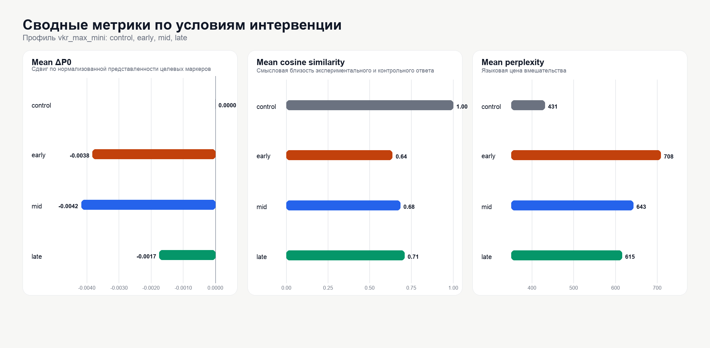
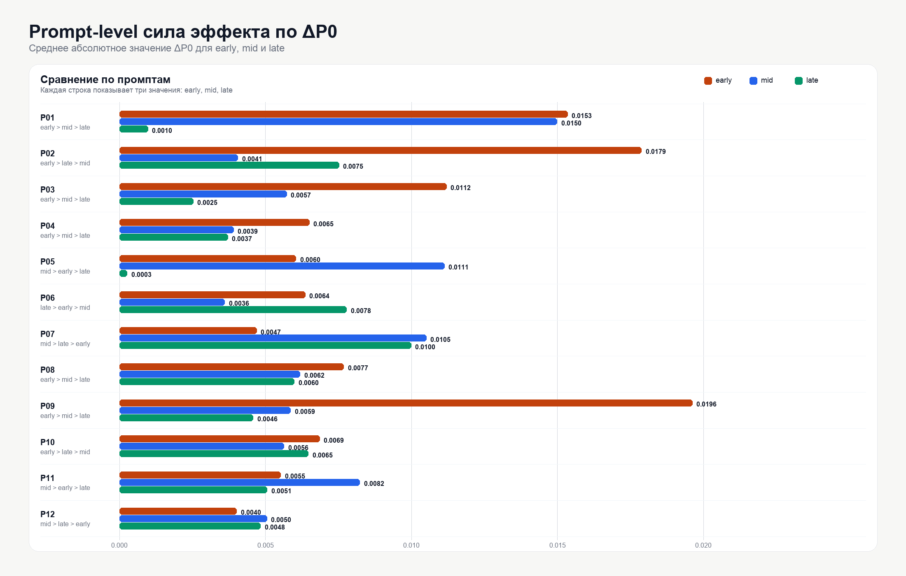

<div align="right">

| [🇬🇧 English](README.en.md) | 🇷🇺 Русский |
|---|---|

</div>

# Positional Sensitivity of Logit Bias in LLMs

Материалы к защите ВКР: [DEFENSE.md](DEFENSE.md)

Репозиторий к моей магистерской работе про `logit_bias`.

Простая идея: **важно ли, где именно включать `logit_bias` в ответе модели?** В начале, в середине и в конце эффект оказался разным.

## TL;DR

Один и тот же `logit_bias` по-разному влияет на текст в зависимости от позиции.

В моих экспериментах:

- `early` и `mid` сильнее меняли структуру ответа;
- `late` менял текст слабее;
- `late` лучше сохранял смысл и качество;
- сильный steering стоил дороже: текст чаще становился менее стабильным.

Главный вывод: у `logit_bias` есть два важных параметра. Первый - значение bias. Второй - место, где он включается.

## Что я проверял

Модель генерирует текст последовательно. Сначала первые токены. Потом следующие. Каждый новый токен попадает в контекст для следующих шагов.

Из-за этого раннее вмешательство может изменить весь дальнейший ответ. Позднее вмешательство чаще влияет только на конец.

Я проверял это на русскоязычных академических мини-ответах. Для оценки взял простой proxy: дискурсивные маркеры.

Примеры таких маркеров:

- `во-первых`;
- `однако`;
- `следовательно`;
- `таким образом`;
- `вероятно`;
- `можно предположить`.

 Это измеримый proxy. Он показывает, как модель строит переходы, выводы и оговорки.

## Как устроен эксперимент

В каждом запуске модель отвечала на один и тот же набор промптов. Было четыре режима:

| Режим | Что происходит |
|---|---|
| `control` | обычный ответ без `logit_bias` |
| `early` | `logit_bias` включается в начале ответа |
| `mid` | `logit_bias` включается в середине ответа |
| `late` | `logit_bias` включается ближе к концу |

`logit_bias` был отрицательным. Он подавлял часть маркеров из словаря.

Технически я использовал `segment_approximation`. Ответ делится на части. Bias включается только в нужной части. Это приближение. Его можно повторить через обычный Chat Completions API.

Основные параметры:

| Параметр | Значение |
|---|---|
| Основная модель | `gpt-4.1-mini` |
| Дополнительная модель | `gpt-4.1-nano` |
| Температура | `0.3` |
| `top_p` | `1.0` |
| Максимальная длина | `180` токенов |
| Промптов | `12` |
| Повторов на режим | `4` |
| `bias_value` | `-8` |
| Основные категории bias | `logical_structuring`, `hedging_epistemic` |

## Что я считал

Я смотрел на три вещи.

| Метрика | Зачем нужна |
|---|---|
| `total_marker_score` | сколько маркеров осталось в тексте |
| `delta_p0` | насколько ответ отличается от `control` по маркерам |
| `cosine_similarity` | насколько ответ похож на `control` по смыслу |
| `perplexity` | насколько выросла “цена” вмешательства для текста |

Важно читать эти метрики вместе. Можно сильно подавить маркеры, но получить плохой текст. Такой результат не считается хорошим steering.

## Результаты

### `gpt-4.1-mini`

| Режим | Runs | Marker score | `delta_p0` | Similarity | Proxy perplexity |
|---|---:|---:|---:|---:|---:|
| `control` | 48 | 0.022198 | 0.000000 | 1.000000 | 430.657701 |
| `early` | 48 | 0.018377 | -0.003821 | 0.635795 | 708.251565 |
| `mid` | 48 | 0.018029 | -0.004170 | 0.683362 | 642.660427 |
| `late` | 48 | 0.020458 | -0.001741 | 0.707965 | 615.383812 |

Коротко:

- `early` и `mid` сильнее снизили маркеры;
- `late` снизил маркеры слабее;
- `late` лучше сохранил similarity;
- `early` дал сильный сдвиг, но сильнее поднял proxy-perplexity.

### `gpt-4.1-nano`

| Режим | Runs | Marker score | `delta_p0` | Similarity | Proxy perplexity |
|---|---:|---:|---:|---:|---:|
| `control` | 48 | 0.017196 | 0.000000 | 1.000000 | 427.378569 |
| `early` | 48 | 0.016681 | -0.000515 | 0.614393 | 705.416285 |
| `mid` | 48 | 0.015500 | -0.001696 | 0.674498 | 639.396919 |
| `late` | 48 | 0.016551 | -0.000645 | 0.701033 | 608.995428 |

На второй модели картина похожая. Эффект слабее, но позиция все равно важна. `late` снова выглядит мягче.

## Что из этого полезно для DS

Если вы используете `logit_bias`, проверяйте две вещи: значение bias и позицию.

- ранний bias может менять весь ответ;
- bias в середине может попасть в важный поворот аргумента;
- поздний bias чаще работает локально;
- более сильный эффект может ухудшить текст.

Для production-сценариев это важно. Иногда нужен сильный сдвиг. Иногда лучше безопасно поправить только конец. Это разные режимы.

## Структура репозитория

```text
.
├── README.md
├── README.en.md
├── experiment/
│   ├── src/                         # код эксперимента
│   ├── data/                        # промпты и словари маркеров
│   ├── config_vkr_max_mini.yaml     # основной профиль
│   ├── config_vkr_max_nano.yaml     # проверка на второй модели
│   ├── outputs_vkr_max_mini/        # результаты gpt-4.1-mini
│   ├── outputs_vkr_max_nano/        # результаты gpt-4.1-nano
│   ├── outputs_vkr_plus/            # промежуточный профиль
│   ├── outputs_vkr_fast/            # быстрый пилот
│   └── profile_comparison.csv       # сравнение профилей
├── figures/                         # графики
└── thesis-md/                       # текст ВКР в Markdown
```

## Где смотреть данные

Главные таблицы:

- [`experiment/outputs_vkr_max_mini/tables/aggregated_by_condition.csv`](experiment/outputs_vkr_max_mini/tables/aggregated_by_condition.csv) - основной результат на `gpt-4.1-mini`;
- [`experiment/outputs_vkr_max_mini/tables/marker_category_comparison.csv`](experiment/outputs_vkr_max_mini/tables/marker_category_comparison.csv) - вклад категорий маркеров;
- [`experiment/outputs_vkr_max_mini/tables/hypothesis_check.csv`](experiment/outputs_vkr_max_mini/tables/hypothesis_check.csv) - проверка по отдельным промптам;
- [`experiment/outputs_vkr_max_nano/tables/aggregated_by_condition.csv`](experiment/outputs_vkr_max_nano/tables/aggregated_by_condition.csv) - проверка на `gpt-4.1-nano`;
- [`experiment/profile_comparison.csv`](experiment/profile_comparison.csv) - сравнение профилей.

Сырые ответы лежат в `raw/*.json` внутри каждого `outputs_*`.

Формат имени:

```text
prompt_id__condition__repN.json
```

Пример:

```text
p03__early__rep2.json
```

## Графики





## Как запустить

Нужны:

- Python 3.11+
- `OPENAI_API_KEY`
- зависимости из `experiment/requirements.txt`

Установка:

```bash
python3 -m pip install -r experiment/requirements.txt
```

Основной профиль:

```bash
export OPENAI_API_KEY=...
python3 experiment/run_experiment.py --config experiment/config_vkr_max_mini.yaml
```

Вторая модель:

```bash
export OPENAI_API_KEY=...
python3 experiment/run_experiment.py --config experiment/config_vkr_max_nano.yaml
```

Сравнение профилей:

```bash
python3 experiment/compare_profiles.py \
  experiment/outputs_vkr_fast \
  experiment/outputs_vkr_plus \
  experiment/outputs_vkr_max_mini \
  experiment/outputs_vkr_max_nano \
  --out experiment/profile_comparison.csv
```

## Ограничения

- Это segment-based steering, не token-by-token steering.
- `delta_p0` - proxy по частоте маркеров.
- `perplexity` - локальный proxy на биграммах.
- Данные - короткие академические ответы на русском.
- Для других жанров и моделей нужны отдельные проверки.
